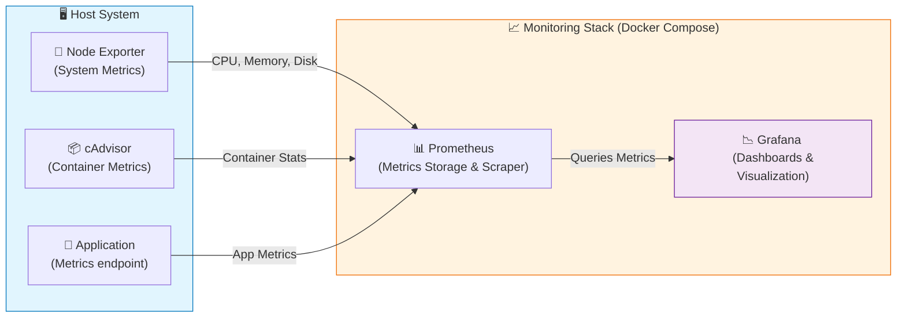

# prometheus-grafana-monitoring
A secure observability stack that also integrates DevSecOps practices.     

## 📊 System & Application Monitoring Stack

A Docker-based monitoring setup using Prometheus, Grafana, Node Exporter, and cAdvisor.          
This setup collects both system-level and container-level metrics, and visualizes them via Grafana dashboards.

## 🧩 Architecture Diagram     



# 🧰 Getting Started     

## 🐍 Run the Python App Locally       

Create and activate a virtual environment      

```python3 -m venv venv```
```source venv/bin/activate   # On Windows: venv\Scripts\activate ```      

Install dependencies        

```pip install -r requirements.txt```         

Run the application      

```python app.py```

## 🐳 Run Everything in Docker         

Ensure Docker and Docker Compose are installed.

### Build and start containers      

From project root where docker-compose.yml lives (and ./monitoring-demo-app contains app.py etc.)       

```docker compose up --build -d```

### Stop and remove all containers         

```docker compose down```          

## Verify Monitoring setup        

Once all services are running:           

| Service       | URL                                                            | Description       |
| ------------- | -------------------------------------------------------------- | ----------------- |
| Prometheus    | [http://localhost:9090](http://localhost:9090)                 | Metrics database  |
| Grafana       | [http://localhost:3000](http://localhost:3000)                 | Dashboards        |
| Node Exporter | [http://localhost:9100/metrics](http://localhost:9100/metrics) | System metrics    |
| cAdvisor      | [http://localhost:8080](http://localhost:8080)                 | Container metrics |

