# prometheus-grafana-monitoring
A secure observability stack that also integrates DevSecOps practices.     

## 📊 System & Application Monitoring Stack

A Docker-based monitoring setup using Prometheus, Grafana, Node Exporter, and cAdvisor.          
This setup collects both system-level and container-level metrics, and visualizes them via Grafana dashboards.

## 🧩 Architecture Diagram     

```mermaid
flowchart LR
    subgraph Host["🖥️ Host System"]
        direction TB
        NE["🧩 Node Exporter\n(System Metrics)"]
        CA["📦 cAdvisor\n(Container Metrics)"]
        APP["🚀 Application\n(/metrics endpoint)"]
    end

    subgraph PrometheusStack["📈 Monitoring Stack (Docker Compose)"]
        direction TB
        PR["📊 Prometheus\n(Metrics Storage & Scraper)"]
        GR["📉 Grafana\n(Dashboards & Visualization)"]
    end

    NE -->|CPU, Memory, Disk| PR
    CA -->|Container Stats| PR
    APP -->|App Metrics| PR
    PR -->|Queries Metrics| GR

    style Host fill:#e1f5fe,stroke:#0277bd,stroke-width:1px
    style PrometheusStack fill:#fff3e0,stroke:#ef6c00,stroke-width:1px
    style GR fill:#f3e5f5,stroke:#6a1b9a,stroke-width:1px
```

